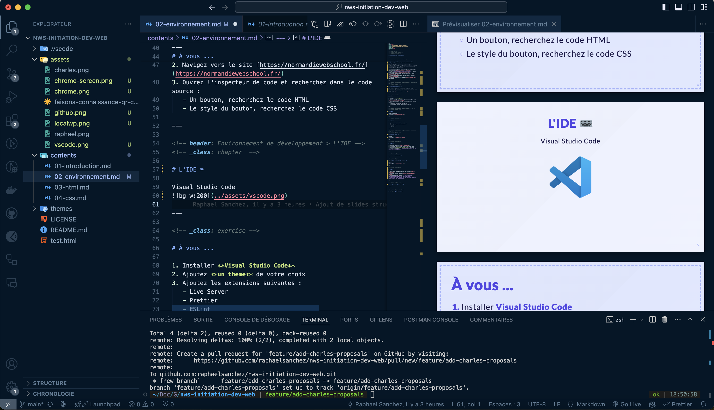
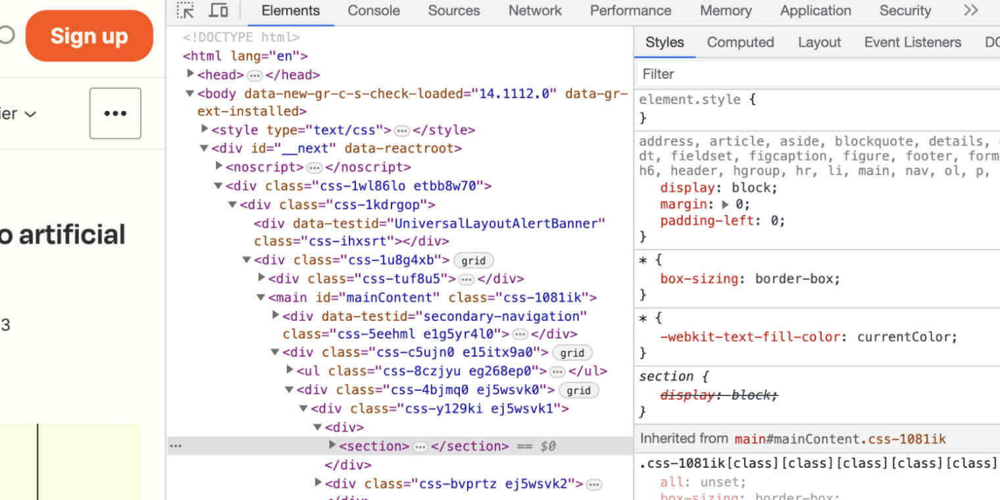
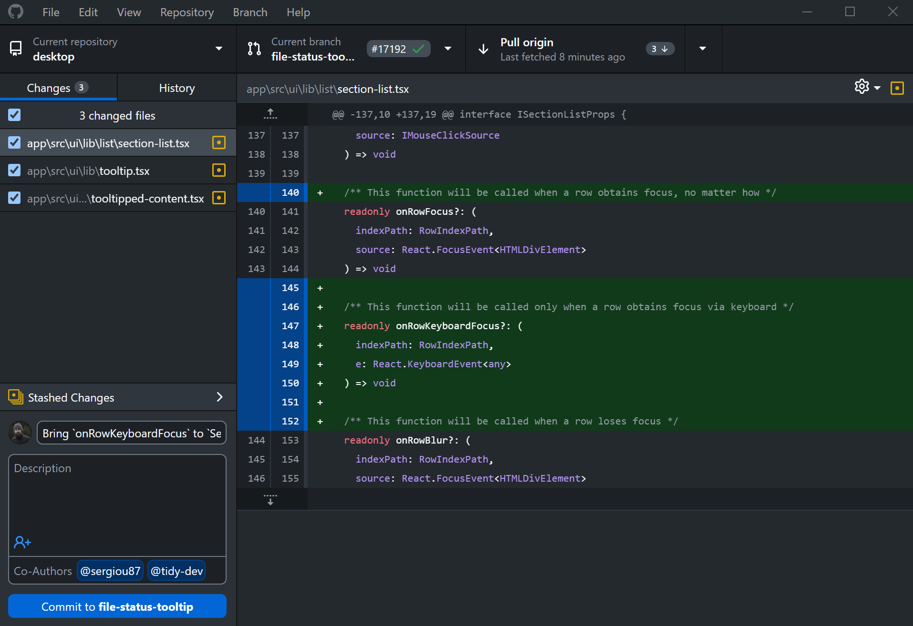
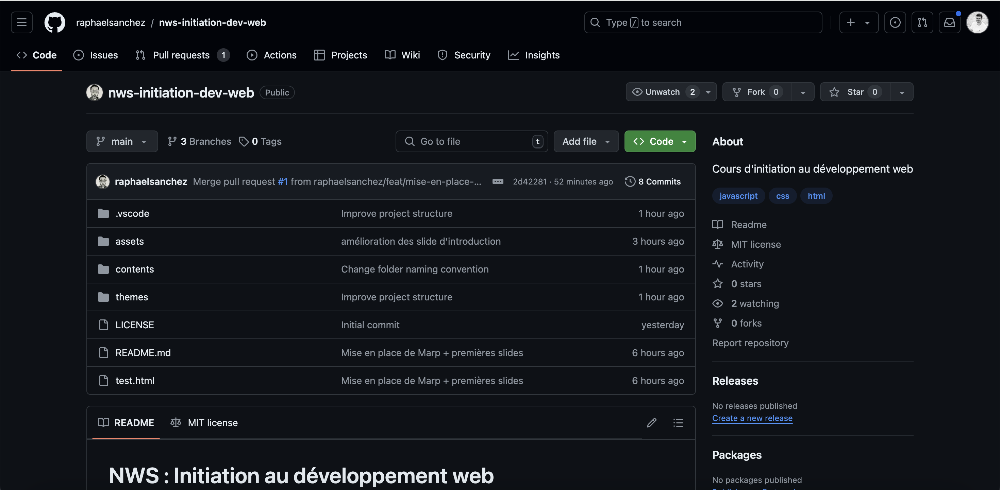

<!-- Slide 01 -->
<!-- _class: cover -->
<!-- _paginate: false -->

## ⌨️ Environnement de développement

Préparer et mettre en place un environnement de développement consiste à configurer les outils et logiciels nécessaires pour coder.

Raphael Sanchez & Charles Sauvat

---

<!-- Slide 02 -->

# Préparer puis mettre en place un environnement de développement

- Un navigateur web avec inspecteur de code performant : [Google Chrome](https://www.google.com/chrome/)
- Un IDE _(Integrated Development Environment)_ : [Visual Studio Code](https://code.visualstudio.com/)
- Un outil de versionnement : [Git](https://git-scm.com/)
- Un serveur local : [LocalWP](https://localwp.com/) par exemple

---

<!-- _class: chapter  -->

# Le navigateur web 👨🏼‍💻

Choisir un bon navigateur est essentiel. Si vous en avez un autre, nous vous recommandons celui-ci.

---

<!-- _class: exercise -->

# À vous ...

1. Installer **Google Chrome**
2. Navigez vers le site [https://normandiewebschool.fr/](https://normandiewebschool.fr/)

---

<!-- _class: chapter  -->

# L'inspecteur d'éléments 👀

L'inspecteur d'éléments est un outil de développement intégré permettant de déboguer et de modifier en temps réel le code d'une page web.

---

<!-- _class: exercise -->

# À vous ...

1. Ouvrez l'inspecteur de code et recherchez dans le code source du site de la NWS :
   - Un bouton, recherchez, copiez le code HTML de celui-ci
   - Le style du bouton, copiez le code CSS de celui-ci

---

<!-- _class: chapter  -->

# L'IDE ⌨️

Pour coder efficacement, nous allons utiliser un logiciel reconnu et doté d'extensions
(Visual Studio Code).

---

<!-- _class: exercise -->

# À vous ...

1. Installer **Visual Studio Code**
2. Ajoutez **le thème** de votre choix
3. Ajoutez les extensions suivantes :
   - Live Server
   - Prettier
   - ESLint
   - Stylelint

---

<!-- _class: chapter  -->

# Le système de gestion de version 📦

GitHub et le versioning sont des outils clés pour gérer les modifications de code et collaborer efficacement.

---

# Les commandes de base dans Github 📦

- Créer une nouvelle branche : `git checkout -b nom-de-votre-branche`
- Ajouter des fichiers à un commit : `git add nom-fichier`
- Ajouter tous les fichiers à un commit : `git add .`
- Préparer votre commit à l'envoi : `git commit -m "texte du commit"`
- Envoyer mon commit vers Github : `git push`

[En apprendre plus sur Github et se perfectionner](https://grafikart.fr/formations/git)

---

<!-- _class: chapter  -->

# Votre premier repository 👶🏻

Pour organiser et sécuriser le développement de votre projet, commencez par créer un repository (dossier), contenant tous les fichiers du projet.

---

<!-- _class: exercise -->

# À vous ...

1. Se créer un compte sur [github.com](https://github.com/)
   - Nom d'utilisateur obligatoire : prenom-nom-nws
2. Créer votre premier repository avec le même nom que votre compte
3. À l'intérieur du repository faire votre premier commit d'un fichier [README.md](https://tiloid.com/p/readme-md-the-ultimate-guide) afin de créer un encard pour vous présenter.

---

<!-- _class: chapter invert -->

# <!-- fit -->Lunch time 🥙

---

<!-- _class: chapter  -->

# Le serveur local 🛜

Pour tester notre code et voir nos modifications, nous allons installer un serveur local, qui nous permettra de travailler sur notre projet sans le rendre accessible à tous en ligne (Local WP).

---

<!-- _class: exercise -->

# À vous ...

1. Installer [LocalWP](https://localwp.com/)
2. Téléchargez le [projet de demo](#) au format .zip
3. Dans LocalWP **créez un nouveau site** à partir de l'archive téléchargée _(⚠️ ne pas décompresser le zip au moment du téléchargement)_

---

<!-- _class: chapter invert -->

# <!-- fit -->Next tomorrow 🥱
