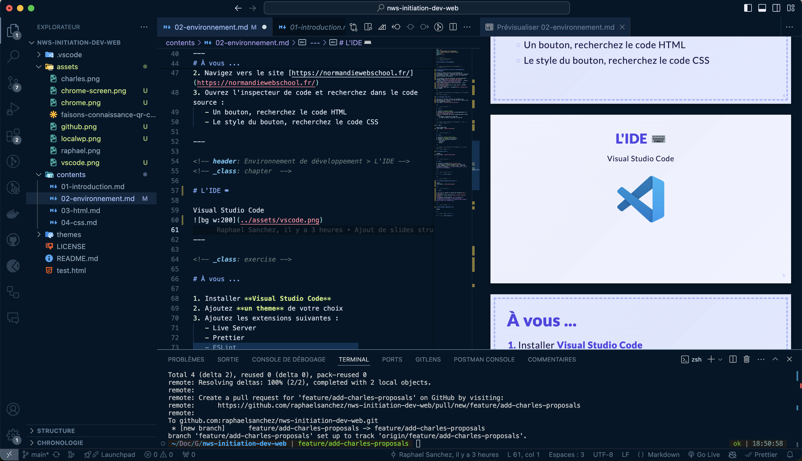
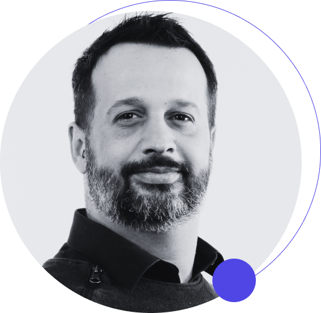

<!-- Slide 01 -->
<!-- _class: cover -->
<!-- _paginate: false -->

## Vos premiers pas dans le développement web

Raphael Sanchez & Charles Sauvat

---

## Le développement web, c'est quoi ?

Le développement web est l'ensemble des tâches liées à la conception, au développement et à la maintenance d'applications web.

- **Front-end** : Ce que l'utilisateur voit et avec quoi il interagit. Il s'agit de la partie visible de l'application.

- **Back-end** : Ce qui se passe en coulisse, côté serveur. Sans cette partie, le front-end n'est qu'une interface sans fonctionnalités ou interactions avancées possibles.

- **Fullstack** : Maîtrise des deux aspects, front-end et back-end.

- **DevOps** : Gestion de l'infrastructure et des déploiements. Le DevOps se concentre sur l'automatisation, la sécurité, la gestion des serveurs...

---

## Avant de commencer, cassons tout de suite quelques idées reçues :

- "Pour faire de l’informatique, il faut être bon en maths" : **C'est faux...**
  _(L'informatique repose plus sur la logique et la résolution de problèmes que sur les mathématiques avancées.)_
- "Ca sert à rien, je veux pas être dev" : **Et pourtant...**
  _(Les compétences en informatique sont utiles dans presque tous les domaines aujourd'hui, même en dehors du développement pur.)_
- "L'informatique, c'est pour les geeks": **Pas du tout**
  _(C’est un outil puissant accessible à tous, et chacun peut y trouver un intérêt, que ce soit pour un usage personnel ou professionnel.)_

---

<!-- _class: chapter -->

# 👨🏼‍💻 Qui sommes-nous ?

---

## Charles Sauvat

Développeur web fullstack
[@NW Groupe](https://www.nw-groupe.com/)

<!-- TODO: a compléter par Charles -->

- Spécialisé en Javascript
- Développeur au sein de la première start-up de la transition énergétique
- 6 ans d'expérience
- Ancien élève de la NWS

---

## Raphael Sanchez

Développeur d'interface et Design System [@Indépendant](https://raphaelsanchez.design)

- 17 ans d'expérience
- Expert accessibilité et eco-conception
- Fan inconditionnel de CSS ♥️
- Intervenant à la NWS depuis 2019

---

## Nous ne sommes pas des profs. Bonne ou mauvaise nouvelle ? 😅

- On est là pour :

  - Vous faire découvrir le développement web.
  - Vous fournir des outils pratiques pour apprendre de manière efficace.
  - Vous accompagner dans la résolution de problèmes et l'acquisition de compétences.

- Vous n’est plus au lycée !  
  On attend de vous une **attitude professionnelle**, c'est-à-dire une implication sérieuse et une initiative personnelle dans votre apprentissage.

---

# Quelques règles de base

- Respectez les horaires
- Respectez les consignes
- Respectez les autres _(surtout les intervenants 😁)_
- Posez des questions !
  _(Vous êtes ici **pour apprendre**. N'hésitez pas à poser des questions, même les plus simples. Nous sommes là pour vous aider.)_
- Soyez patients et bienveillants
  _(Au départ, le code peut sembler incompréhensible. Mais n'oubliez pas : la patience est la clé du succès.)_

👉 Mais surtout, soyez **attentifs**, **currieux** et **pro-actifs**

---

<!-- _class: chapter -->

# Et vous, qui êtes-vous ?

Completez ce court questionnaire

s
