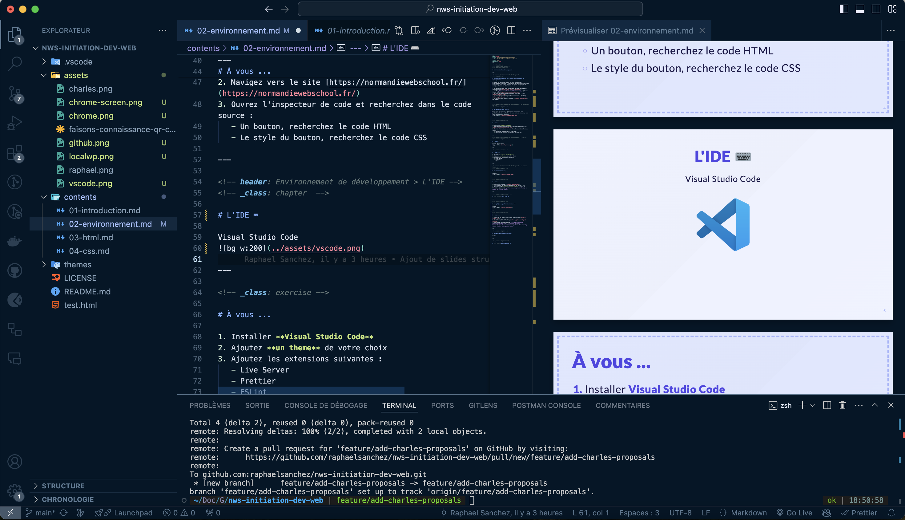
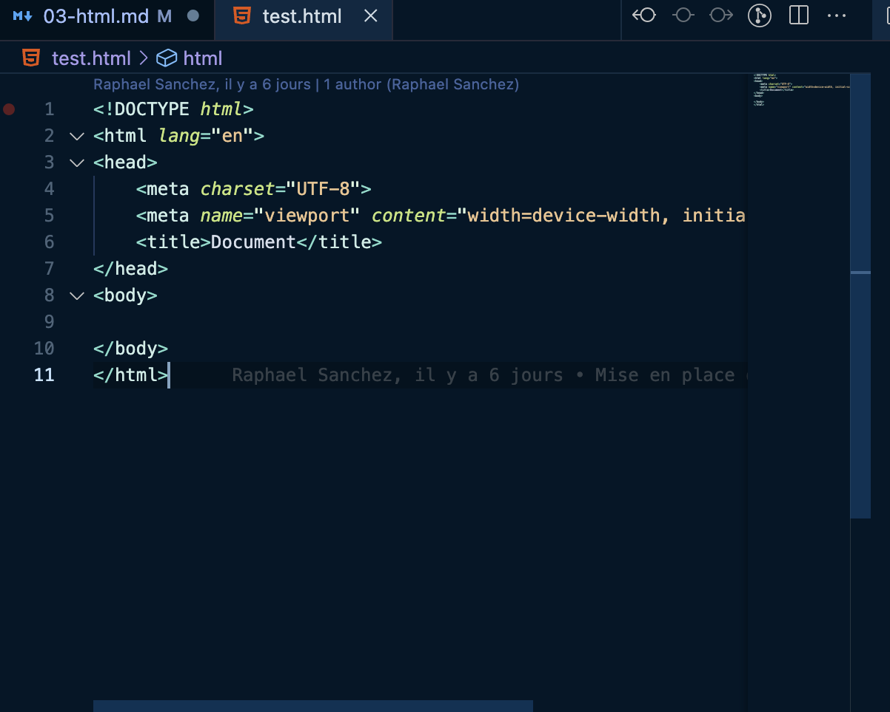
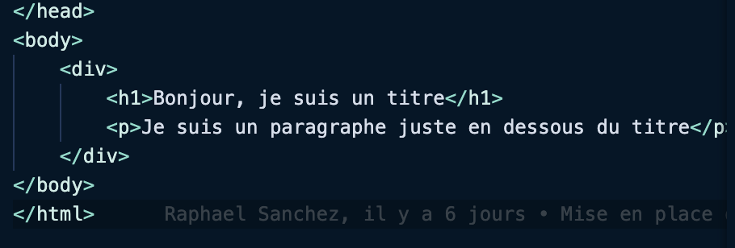

<!-- Slide 01 -->
<!-- _class: cover -->
<!-- _paginate: false -->




## ⌨ Introduction au HTML

Explorer la structure d'un document HTML en découvrant les balises associées, en créant votre premier texte, votre premier lien hypertexte, et en visualisant le résultat.

Raphael Sanchez & Charles Sauvat

---

## Le HTML c'est quoi ?

- Acronyme de **Hyper Text Markup Language**
- Langage dit de « marquage » et non de programmation
- Il est composé de balises
- Les balises définissent la structure du document
- Elles permettent de décrire le contenu de la page

HTML fait tourner TOUT le web, sans exception _(et aussi certaines applications mobiles ou desktop ! 🫠)_

---

## Structure de base d'une page HTML

```html
<!DOCTYPE html>
<html>
  <head>
    <!-- Informations pour le navigateur (non visible) -->
  </head>
  <body>
    <!-- Information affichées dans la page -->
  </body>
</html>
```

---

## Les balises HTML

- Les balises sont des éléments de structure
- Elles permettent de définir le rôle de chaque partie du document
- Elles sont toujours écrites entre chevrons `< >`
- Souvent utilisées par paire : `<balise> ... </balise>`
- Parfois **auto-fermantes** `<balise />`

---

<!-- header: '' -->
<!-- _class: chapter  -->

# 👨🏻‍🏫 Apprendre à structurer un document en HTML



Découverte des balises essentielles pour structurer un document, et création de votre première page HTML.

---

## Structure de base d'un document .html

- `<!docktype html>`: Déclaration obligatoire qui indique au navigateur quel type de document HTML il est en train de traiter.[Doc](https://developer.mozilla.org/fr/docs/Glossary/Doctype)
- `<html>`: Balise racine qui englobe l'ensemble du contenu HTML de la page. Elle sert de conteneur pour tous les éléments visibles et invisibles d'une page web. [Doc](https://developer.mozilla.org/fr/docs/Web/HTML/Element/html)
- `<head>`: Balise utilisée pour fournir des métadonnées sur le document. Elle joue un rôle crucial pour le SEO (référencement) et l’accessibilité. [Doc](https://developer.mozilla.org/fr/docs/Web/HTML/Element/head)
- `<body>`: Balise contenant le contenu principal de la page visible par l'utilisateur. Tout ce qui apparaît sur la page web se trouve à l'intérieur de cette balise. [Doc](https://developer.mozilla.org/fr/docs/Web/HTML/Element/body)

---

<!-- header: "Apprendre à structurer un document en HTML" -->

## Les balises à retrouver dans une structure

- `<title>`: Cette balise définit le titre de la page web, qui est généralement affiché dans l'onglet du navigateur. Elle est essentielle pour le référencement (SEO). [Doc](https://developer.mozilla.org/en-US/docs/Web/HTML/Element/title)
- `<meta>`: Ces balises servent à fournir des informations supplémentaires sur la page, souvent invisibles pour l'utilisateur, mais cruciales pour les moteurs de recherche et les réseaux sociaux. [Doc](https://developer.mozilla.org/fr/docs/Web/HTML/Element/meta)
- `<link>`: Utilisée pour relier la page HTML à des ressources externes, telles que des feuilles de style CSS. [Doc](https://developer.mozilla.org/fr/docs/Web/HTML/Element/link)
- `<script>`: Cette balise permet d'intégrer ou de lier des scripts JavaScript, qui sont utilisés pour ajouter des fonctionnalités interactives à la page.[Doc](https://developer.mozilla.org/fr/docs/Web/HTML/Element/script)

---

<!-- header: '' -->
<!-- _class: chapter  -->

# 🖼️ Apprendre à utiliser les balises sémantiques



Explorer les balises sémantiques, créer des textes, créer des liens, faire des retours à la ligne, des listes...

---

<!-- header: "Apprendre à structurer un document en HTML" -->

## Formater du texte

- `<h1>`: Cette balise est utilisée pour les titres principaux sur une page web. Elle existe sous plusieurs déclinaisons, telles que <h2>, <h3>, <h4>, etc.[Doc](https://developer.mozilla.org/fr/docs/Web/HTML/Element/Heading_Elements)
- `<p>`: Cette balise est utilisée pour définir des paragraphes de texte.[Doc](https://developer.mozilla.org/fr/docs/Web/HTML/Element/p)
- `<strong>, <em>`: Ces balises sont utilisées pour mettre en valeur du texte. [Doc](https://developer.mozilla.org/fr/docs/Web/HTML/Element/strong)
- `<ul>, <ol>, et <li>`: Ces balises sont utilisées pour créer des listes (à puces, numérotées..). [Doc](https://developer.mozilla.org/fr/docs/Learn/CSS/Styling_text/Styling_lists)
- `<a>`: Cette balise est utilisée pour créer des liens hypertextes. [Doc](https://developer.mozilla.org/fr/docs/Web/HTML/Element/a)
- `<br />`: Cette balise est utilisée pour faire un saut de ligne. [Doc](https://developer.mozilla.org/fr/docs/Web/HTML/Element/br)

---

<!-- _class: exercise -->

# À vous ...

1. Créer votre **première page html**.
2. Ajoutez y à l'intérieur : un titre, un sous-titre, un paragraphe avec un saut de ligne et un mot en gras puis un lien hypertexte.
3. Visualisez cette page depuis votre navigateur.
