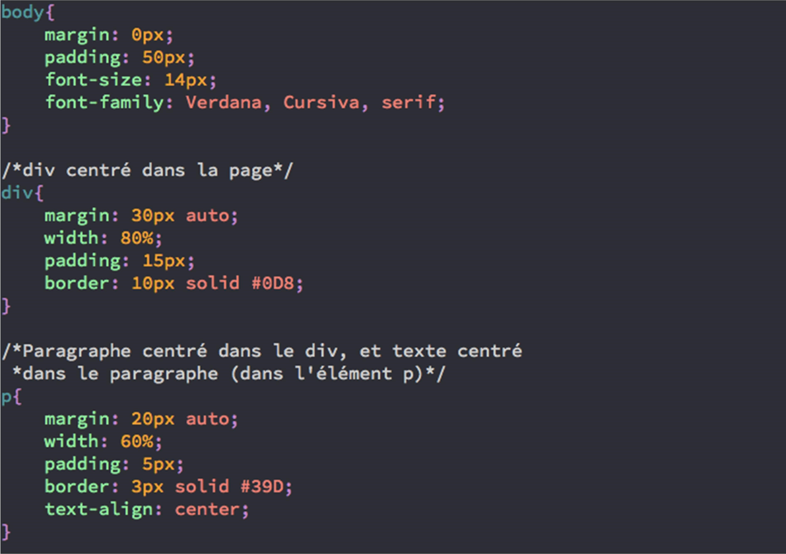

<!-- Slide 01 -->
<!-- _class: cover -->
<!-- _paginate: false -->

## ⌨ Introduction au CSS

Découvrez les bases du CSS pour styliser vos pages web. Apprenez à appliquer vos premiers styles, changer les couleurs, ajuster les tailles...

Raphael Sanchez & Charles Sauvat

---

<!-- header: Introduction au CSS -->
<!-- Slide 02 -->

# Le CSS c'est quoi ?

CSS, acronyme de **Cascading Style Sheets**, est un langage de feuilles de style qui permet de contrôler la présentation visuelle des éléments HTML sur une page web.

- Langage du web ouvert standardisé par le W3C
- Définit l'apparence d'éléments comme les couleurs, les polices, les espacements, les bordures, et les marges.
- Permet d'adapter l'apparence des sites à différents formats d'écran (ordinateur, tablette, mobile)
- Gère des animations et des transitions, ajoutant des effets visuels pour une meilleure expérience utilisateur

---

<!-- header: '' -->
<!-- _class: chapter  -->

# 🎨 Première stylisation de ma page HTML

Découverte des balises essentielles pour styliser un document, et création de votre première feuille de style CSS.

---

<!-- _class: chapter  -->

# Apprendre à utiliser CSS pour composer une mise en page
